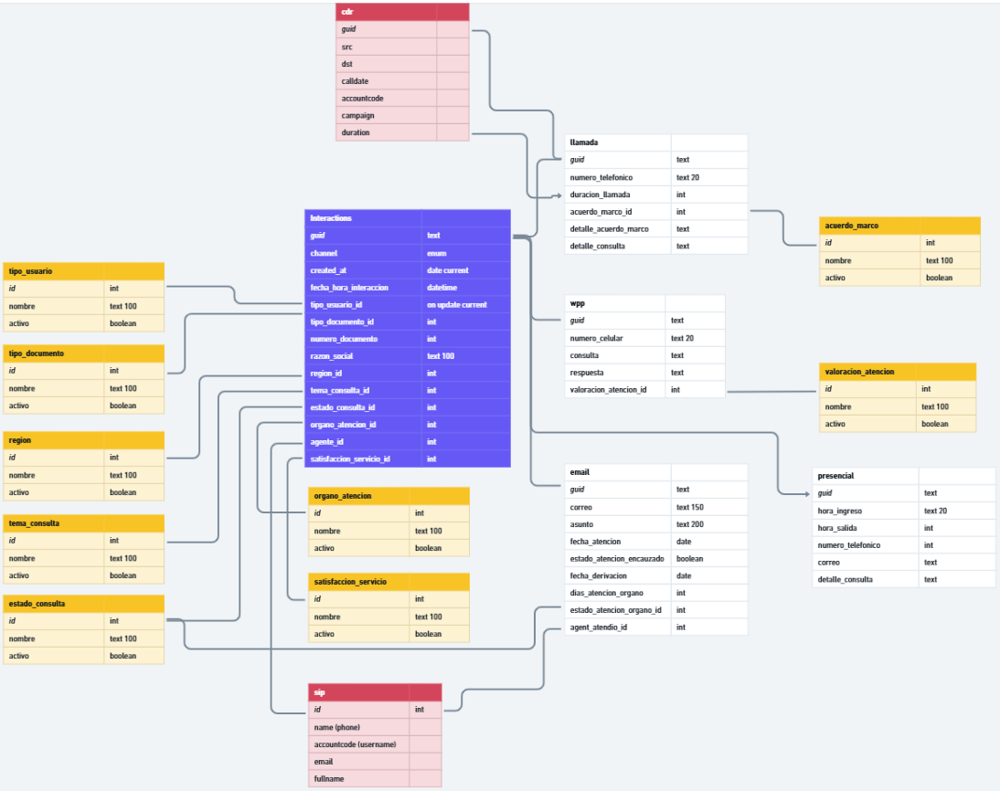

# Formulario de Gestión de Interacciones Multi-Canal - PeruCompras

Sistema integral de gestión de consultas e interacciones para PeruCompras, desarrollado con Vue3 y Vuetify 3 para uContact v6.

## Descripción General

Este formulario permite registrar, gestionar y realizar seguimiento de interacciones de clientes/usuarios a través de múltiples canales de comunicación: llamadas telefónicas, WhatsApp, correo electrónico, chat web y atención presencial.

## Características Principales

### 1. Gestión Multi-Canal

El sistema soporta cinco canales de comunicación, cada uno con campos específicos:

#### **LLAMADA** (Llamada Telefónica)

- Número telefónico (11-20 dígitos)
- Duración de llamada (en segundos)
- Acuerdo marco relacionado
- Detalle del acuerdo marco
- Detalle de la consulta

#### **WHATSAPP**

- Número de celular (11 dígitos)
- Consulta del usuario
- Respuesta proporcionada
- Valoración de la atención

#### **EMAIL** (Correo Electrónico)

- Correo electrónico del usuario
- Asunto del mensaje
- Fecha de atención
- Estado de atención
- Encauzado (sí/no)
- Fecha de derivación
- Días de atención por órgano
- Estado de atención del órgano
- Agente que atendió

#### **WEBCHAT** (Chat Web)

- Solo utiliza campos comunes de interacción
- No requiere tabla adicional

#### **PRESENCIAL** (Atención en Oficina)

- Hora de ingreso
- Hora de salida
- Número telefónico (opcional)
- Correo electrónico (opcional)
- Detalle de la consulta

### 2. Campos Comunes de Interacción

Todos los canales comparten los siguientes campos:

- **Datos del Usuario:**
  - Razón social / Nombre completo (obligatorio)
  - Tipo de usuario (obligatorio)
  - Tipo de documento
  - Número de documento (11+ dígitos)
  - Región

- **Datos de la Consulta:**
  - Tema de consulta (obligatorio)
  - Estado de consulta (obligatorio, por defecto: "Pendiente")
  - Órgano de atención
  - Satisfacción con el servicio

- **Metadata:**
  - GUID único (generado automáticamente)
  - Canal de comunicación
  - ID del agente que atendió
  - Fecha de creación/actualización automática

### 3. Integración CTI (Computer Telephony Integration)

- **Detección Automática:** El formulario detecta si proviene de una llamada CTI
- **Datos Pre-cargados:**
  - GUID de la sesión
  - Canal de comunicación (LLAMADA desde CTI)
  - Número de teléfono del llamante (CallerID)
  - Campaña asociada
- **Identificación de Agente:** Obtiene el ID del agente desde el sistema SIP

### 4. Sistema de Búsqueda Avanzada

Pestaña dedicada para buscar interacciones históricas con múltiples filtros:

- **Filtros Disponibles:**
  - Número de teléfono (búsqueda parcial)
  - Número de documento (búsqueda parcial)
  - Razón social / Nombre (búsqueda parcial)
  - Canales (selección múltiple)
  - Agente que atendió
  - Estado de consulta (por defecto: "Pendiente")

- **Características de Búsqueda:**
  - Carga automática al cambiar a la pestaña de búsqueda
  - Resultados en tabla con paginación (10 registros por página)
  - Acción para cargar registro en el formulario
  - Detección de duplicados al cargar desde búsqueda

### 5. Validaciones Implementadas

#### Validaciones de Formulario:

- Campos obligatorios marcados con asterisco (\*)
- Razón social: obligatoria
- Tipo de usuario: obligatorio
- Tema de consulta: obligatorio
- Estado de consulta: obligatorio

#### Validaciones de Formato:

- **Teléfono:** 11-20 dígitos, solo números
- **Documento:** 11+ dígitos, solo números
- **Email:** Formato de correo válido

#### Validaciones de Base de Datos:

- Detección de errores en INSERT/UPDATE
- Verificación de límites de caracteres
- Notificaciones específicas por tipo de error

### 6. Carga de Catálogos

El sistema carga automáticamente 9 catálogos desde la base de datos:

1. Tipos de Usuario
2. Tipos de Documento
3. Regiones
4. Temas de Consulta
5. Estados de Consulta
6. Órganos de Atención
7. Satisfacción del Servicio
8. Valoración de Atención
9. Acuerdos Marco

Todos los catálogos utilizan componentes `v-autocomplete` para facilitar la búsqueda y selección.

### 7. Manejo de Errores

- **Validación en Cliente:** Previene envío de formularios incompletos
- **Validación en Servidor:** Detecta errores de base de datos (UC_exec_async)
- **Notificaciones Contextuales:**
  - Éxito al guardar (verde)
  - Errores de validación (rojo)
  - Errores de base de datos específicos por canal
- **Manejo de Restricciones:** Detecta violaciones de límites de caracteres

### 8. Operaciones CRUD

#### **Crear (INSERT):**

- Nueva interacción con GUID único
- Registro en tabla principal + tabla específica del canal
- Validación completa antes de guardar

#### **Leer (SELECT):**

- Búsqueda con filtros múltiples
- Carga de registros existentes en el formulario
- Joins con tablas de catálogos para mostrar descripciones

#### **Actualizar (UPDATE):**

- Detección automática de modo edición (cuando se carga desde búsqueda)
- Actualización de tabla principal y tabla del canal
- Preservación del GUID original

### 9. Gestión de Estado

- **Modo Nuevo:** Formulario limpio, GUID autogenerado
- **Modo Edición:** Carga desde búsqueda, GUID preservado
- **Reset Inteligente:**
  - Limpia formulario después de guardar exitosamente
  - Preserva canal PRESENCIAL si no hay CTI
  - Restaura canal desde CTI si está disponible
- **Prevención de Duplicados:** Mensaje de advertencia al cargar mismo registro

## Integración con uContact

### Funciones API Utilizadas:

- **`UC_get_async(query, "Repo")`**: Ejecutar consultas SELECT y obtener resultados
- **`UC_exec_async(query, "Repo")`**: Ejecutar INSERT/UPDATE/DELETE (retorna "OK" o "ERROR")
- **`UC_closeForm()`**: Cerrar el formulario después de guardar (solo con CTI)

### Objetos Globales:

- **`CTI`**: Objeto JSON con datos de la llamada (Guid, Channel, Callerid, Form, Campaign)
- **`Agent`**: Objeto con información del agente (accountcode para mapear con SIP)

## Esquema de Base de Datos

### Tabla Principal: `PERUCOMPRAS_interaction`

Almacena datos comunes de todas las interacciones.

### Tablas Específicas por Canal:

- `PERUCOMPRAS_interaction_llamada`
- `PERUCOMPRAS_interaction_whatsapp`
- `PERUCOMPRAS_interaction_email`
- `PERUCOMPRAS_interaction_presencial`

### Tablas de Catálogos:

- `PERUCOMPRAS_tipo_usuario`
- `PERUCOMPRAS_tipo_documento`
- `PERUCOMPRAS_region`
- `PERUCOMPRAS_tema_consulta`
- `PERUCOMPRAS_estado_consulta`
- `PERUCOMPRAS_organo_atencion`
- `PERUCOMPRAS_satisfaccion_servicio`
- `PERUCOMPRAS_valoracion_atencion`
- `PERUCOMPRAS_acuerdo_marco`

### Tabla Externa:

- `ccdata.sip`: Para mapear agentes

## Tecnologías Utilizadas

- **Vue 3**: Framework JavaScript progresivo
- **Vuetify 3.6.11**: Framework de componentes Material Design
- **MariaDB**: Sistema de base de datos
- **uContact v6**: Plataforma de contact center
- **Material Design Icons**: Iconografía

## Flujo de Trabajo

1. **Inicio:**
   - El formulario detecta si viene de CTI o es acceso manual
   - Carga catálogos desde base de datos
   - Determina canal inicial (LLAMADA desde CTI, PRESENCIAL manual)

2. **Captura de Datos:**
   - Usuario llena campos comunes y específicos del canal
   - Validaciones en tiempo real
   - Búsqueda de interacciones previas si necesario

3. **Guardado:**
   - Validación de campos obligatorios
   - INSERT o UPDATE según sea nuevo o existente
   - Guardado en tabla principal y tabla del canal
   - Verificación de éxito/error de base de datos

4. **Finalización:**
   - Notificación de éxito o error específico
   - Reset del formulario (si guardado exitoso)
   - Cierre automático del formulario (solo con CTI)

## Mantenimiento

### Agregar Nuevo Catálogo:

1. Crear tabla en `create.sql`
2. Agregar datos en `insert.sql`
3. Añadir llamada en `loadCatalogs()` en `index.js`
4. Agregar campo en `data()` para almacenar el catálogo
5. Crear `v-autocomplete` en `index.html`

### Agregar Nuevo Canal:

1. Crear tabla específica en `create.sql`
2. Agregar estructura de datos en `data()` de `index.js`
3. Implementar lógica en `saveChannelSpecificData()`
4. Añadir sección en template de `index.html` con `v-if`
5. Agregar opción de canal en búsqueda

## Notas Técnicas

- **Seguridad SQL:** Todos los strings se escapan con `.replace(/'/g, "''")`
- **Validación Dual:** Cliente (Vue) y servidor (base de datos)
- **Modo Asíncrono:** Todas las operaciones de BD usan async/await
- **Responsive:** Diseño adaptable usando Vuetify grid system
- **Accesibilidad:** Labels claros y mensajes de error descriptivos
